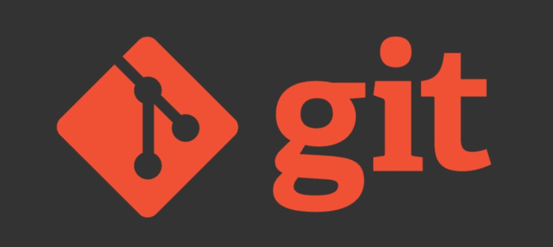

# Git for Noobs



This documentation will help you get started with Git, it's terminology, and also contains the most 
widely used git commands.

This documentation is open for contribution and for updating any mistakes.

## Table of contents
- [What is Git?](#what-is-git)
- [Setting it up locally](#setting-it-up-locally)
- [Configuring Git](#configuring-git)
- [Concepts and terminology](#concepts-and-terminology)
- [Most widely used commands along with their use cases](#most-widely-used-commands-along-with-their-use-cases)
  - [git add](#git-add)
  - [git apply](#git-apply)
  - [git branch](#git-branch)
  - [git checkout](#git-checkout)
  - [git clone](#git-clone)
  - [git commit](#git-commit)
  - [git config](#git-config)
  - [git describe](#git-describe)
  - [git diff](#git-diff)
  - [git fetch](#git-fetch)
  - [git init](#git-init)
  - [git log](#git-log)
  - [git merge](#git-merge)
  - [git mv](#git-mv)
  - [git notes](#git-notes)
  - [git pull](#git-pull)
  - [git push](#git-push)
  - [git rebase](#git-rebase)
  - [git remote](#git-remote)
  - [git replace](#git-replace)
  - [git reset](#git-reset)
  - [git restore](#git-restore)
  - [git revert](#git-revert)
  - [git rm](#git-rm)
  - [git show](#git-show)
  - [git stash](#git-stash)
  - [git status](#git-status)
  - [git switch](#git-switch)
  - [git tag](#git-tag)
- [References](#references)


## What is Git?
Version control, also known as source control, is the practice of tracking and managing changes to 
software code. Version control systems (VSCs) are software tools that help software teams manage changes to 
source code over time. As development environments have accelerated, version control systems help 
software teams work faster and smarter.

Git is the most widely used modern version control system in the world today. Having a distributed 
architecture, Git is an example of a DVCS (hence Distributed Version Control System). Rather than have 
only one single place for the full version history of the software as is common in once-popular 
version control systems like CVS or Subversion (also known as SVN), in Git, every developer's 
working copy of the code is also a repository that can contain the full history of all changes.

## Setting it up locally
### Installation

To install Git on your local machine, visit [https://git-scm.com/downloads](https://git-scm.com/downloads). 
Depending on your operating system, download and install the latest version accordingly. During the 
installation process, make sure that you select thr option to add **git** to your path. This makes 
sure that the git commands are recognized from any location in the terminal.

### Verify the installation
Open your terminal and type the command `git --version`, if you see the git version in the output, it 
means that the installation was successful.

### Some useful options
To print the Git version that is currently installed:
```
$ git --version
```

To print the synopsis, and a list of the most commonly used commands:
```
$ git --help
```

If the option `--all` or `-a` is given then all the available commands are printed:
```
$ git --help --all
```

If a Git command (`config` in this case) is mentioned along with `--help`, it brings up the manual 
page for that command in your browser:
```
$ git --help config
```

## Configuring Git
Git uses a series of configuration files to determine non-default behavior that you may want. The 
first place Git looks for these values is in the system-wide `[path]/etc/gitconfig` file, which 
contains settings that are applied to every user on the system and all of their repositories. 
If you pass the option `--system` to git config, it reads and writes from this file specifically.

The next place Git looks is the `~/.gitconfig` (or `~/.config/git/config`) file, which is specific 
to each user of the system. You can make Git read and write to this file by passing the `--global` 
option.

Finally, Git looks for configuration values in the configuration file in the Git directory 
(`.git/config`) of whatever repository you’re currently using. These values are specific to that 
single repository, and represent passing the `--local` option to git config. If you don’t specify which 
level you want to work with, this is the default.

Each of these “levels” (system, global and local) overwrites values in the previous level, so values 
in `.git/config` (global config, which applies to a single user of the system) trump those in 
`[path]/etc/gitconfig` (system config, which applies to all users of the system), for instance.

### Configuration levels
In order to specify the git configuration for all the users of the system, use:
```
$ git config --system
```

In order to specify the git configuration for a specific user of the system, use:
```
$ git config --global
```

In order to specify the git configuration for the current git project that you're using, use:
```
$ git config --local
```

If no level is specified along with the `git config` command, then the default level is local. 
Therefore, using `git config --local` or `git config` would be the same.
   
### Setting the config properties
Below are a few example that show how a git property is set at any level.
To set the `user.name` property on the global level (inside `.git/config` file):
```
$ git config --global user.name={username}
```

To set the `user.email` property on the system level (inside `[path]/etc/gitconfig` file):
```
$ git config --system user.email={useremail}
```

### Listing the config properties
To see all the properties configured globally in Git, you can use the `–-list` option on the git config 
command. Adding the `-–show-origin` option will also output the gitconfig file’s location (based on 
what level is selected - local, global or system).

List all the properties present in the global gitconfig file and also output the location of the 
global gitconfig file on your machine:
```
$ git config --global --list --show-origin
```
   
### Updating the config properties
To add a new proxy, without altering any of the existing ones:
```
$ git config --global --add core.gitproxy '"proxy-command" for example.com'
```

To remove or unset a config property:
```
$ git config --global --unset core.editor
```

To remove or unset all the values of a property:
```
$ git config --global --unset-all core.editor
```

To edit the git config file via the default git editor:
```
$ git config --global --edit
```

## Concepts and terminology
### Local Repository
Every version control system tool provides a private workplace as a working copy. Developers make 
changes in their private workplace and after commit, these changes become a part of the repository. 
Git takes it one step further by providing them a private copy of the whole repository. Users can 
perform many operations with this repository such as add file, remove file, rename file, move file, 
commit changes, and many more.

### Working Directory and Staging Area or Index
The working directory is the place where files are checked out. Git does not track each and every 
modified file. Whenever you do commit an operation, Git looks for the files present in the staging 
area. Only those files present in the staging area are considered for commit and not all the 
modified files.

Let us see the basic workflow of Git.

Step 1 − You modify a file from the working directory.

Step 2 − You add these files to the staging area.

Step 3 − You perform commit operation that moves the files from the staging area. After push operation, 
it stores the changes permanently to the Git repository.


### Blobs
Blob stands for Binary Large Object. Each version of a file is represented by blob. A blob holds 
the file data but does not contain any metadata about the file. It is a binary file, and in Git 
database, it is named as SHA1 hash of that file. In Git, files are not addressed by names. 
Everything is content-addressed.

### Trees
Tree is an object, which represents a directory. It holds blobs as well as other sub-directories. 
A tree is a binary file that stores references to blobs and trees which are also named as SHA1 hash 
of the tree object.

### Commits
Commit holds the current state of the repository. A commit is also named by SHA1 hash. You can consider 
a commit object as a node of the linked list. Every commit object has a pointer to the parent commit 
object. From a given commit, you can traverse back by looking at the parent pointer to view the 
history of the commit. If a commit has multiple parent commits, then that particular commit has been 
created by merging two branches.

### Branches
Branches are used to create another line of development. By default, Git has a master branch, which 
is same as trunk in Subversion. Usually, a branch is created to work on a new feature. Once the 
feature is completed, it is merged back with the master branch and we delete the branch. Every branch 
is referenced by HEAD, which points to the latest commit in the branch. Whenever you make a commit, 
HEAD is updated with the latest commit.

### Tags
Tag assigns a meaningful name with a specific version in the repository. Tags are very similar to 
branches, but the difference is that tags are immutable. It means, tag is a branch, which nobody 
intends to modify. Once a tag is created for a particular commit, even if you create a new commit, 
it will not be updated. Usually, developers create tags for product releases.

### Clone
Clone operation creates the instance of the repository. Clone operation not only checks out the 
working copy, but it also mirrors the complete repository. Users can perform many operations with 
this local repository. The only time networking gets involved is when the repository instances are 
being synchronized.

### Pull
Pull operation copies the changes from a remote repository instance to a local one. The pull operation 
is used for synchronization between two repository instances. This is same as the update operation in 
Subversion.

### Push
Push operation copies changes from a local repository instance to a remote one. This is used to store 
the changes permanently into the Git repository. This is same as the commit operation in Subversion.

### HEAD
HEAD is a pointer, which always points to the latest commit in the branch. Whenever you make a commit, 
HEAD is updated with the latest commit. The heads of the branches are stored in `.git/refs/heads/` 
directory.

### Revision
Revision represents the version of the source code. Revisions in Git are represented by commits. 
These commits are identified by SHA1 secure hashes.

### URL
URL represents the location of the Git repository. Git URL is stored in config file.

## Most widely used commands along with their use cases
This list contains some of the most widely used git commands, and is open for accepting contributions

### git add
The git add command adds a change in the working directory to the staging area. It tells Git that 
you want to include updates to a particular file in the next commit. Changes are not actually recorded 
until you run `git commit` after.

To add all changes of the mentioned file to the staging area:
```
$ git add <file>
```

To add all changes of the mentioned directory to the staging area:
```
$ git add <directory>
```

To add all the changes in all the files to the staging area:
```
$ git add .
```

### git apply
The changes present in a patch file (e.g. the output of git diff) can be applied to the working directory 
by using the git apply command. With the `--index` option the patch is also applied to the index, 
and with the `--cached` option the patch is only applied to the index.
```
$ git apply <patch-file>
```


### git branch
In Git, branches are effectively a pointer to a snapshot of your changes. When you want to add a new 
feature or fix a bug no matter how big or how small you spawn a new branch to encapsulate your changes.

List all the branches in your local repository (`git branch --list` can also be used to generate the same 
output):
```
$ git branch
```

Create a new branch locally. This does not check out the new branch:
```
$ git branch <branch>
```

Delete the specified local branch. This is a “safe” operation in that Git prevents you from deleting the 
branch if it has unmerged changes:
```
$ git branch -d <branch>
```

Force delete the specified local branch, even if it has unmerged changes.
```
$ git branch -D <branch>
```

Rename the current local branch:
```
$ git branch -m <new-branch>
```

List all the branches of the current repository both local and remote:
```
$ git branch -a
```

Deleting a remote branch:
```
$ git push origin --delete <branch>
```
or
```
$ git push origin :<branch>
```

### git checkout
The git checkout command operates upon three distinct entities: files, commits, and branches.

**Checking out branches:**

The git checkout command lets you navigate between the branches created by git branch. Checking out a 
branch updates the files in the working directory to match the version stored in that branch, and it 
tells Git to record all new commits on that branch.

Switch to an existing local branch:
```
$ git checkout <branch>
```

Create a new local branch and switch to it:
```
$ $ git checkout -b <new-branch> (The <new-branch> is based off of the current HEAD)
```

By default git checkout -b will base the new-branch off the current HEAD. If an optional additional 
parameter is passed, then the new-branch is based off of branch specified instead of the current HEAD.
```
$ git checkout -b ＜new-branch＞ ＜existing-branch＞ (The <new-branch> is based off of <existing-branch>)
```

Checking out to a remote branch (In order to checkout a remote branch you have to first fetch the contents of the branch):
```
$ git fetch --all
$ git checkout ＜remote-branch＞
```

**Checking out commits:**

To checkout a specific commit, you can use the git checkout command and provide the commit hash 
as a parameter:
```
$ git checkout <commit-hash> (e.g. git checkout 123abc123)
```

**Checking out files:**

The git checkout command when used along with a file discards all the file changes in the working 
directory:
```
$ git checkout <file-name>
$ git checkout . (discards all the changes in all the modified files in the working directory)
```

### git clone
git clone is a Git command line utility which is used to target an existing repository and create a 
clone, or copy of the target repository.
```
$ git clone <repo>
```

Cloning to a specific folder:
```
$ git clone <repo> <directory>
```

Cloning a specific tag:
```
$ git clone --branch <tag> <repo>
```

Cloning a specific branch:
```
$ git clone -b <branch> <repo>
```

### git commit
The git commit command captures a snapshot of the project's currently staged changes. Committed 
snapshots can be thought of as “safe” versions of a project—Git will never change them unless you 
explicitly ask it to. Prior to the execution of git commit, The git add command is used to promote or 
'stage' changes to the project that will be stored in a commit.

Commit the staged snapshot. This will launch a text editor prompting you for a commit message. 
After you’ve entered a message, save the file and close the editor to create the actual commit.
```
$ git commit
```

Commit with an inline message:
```
$ git commit -m "Initial commit"
```

Instead of creating a new commit, add/append staged changes to the previous commit:
```
$ git commit --amend
```

### git config
### git describe
### git diff
### git fetch
### git init
### git log
### git merge
### git mv
### git notes
### git pull
### git push
### git rebase
### git remote
### git replace
### git reset
### git restore
### git revert
### git rm
### git show
### git stash
### git status
### git switch
### git tag

## Miscellaneous
### The `.gitignore` file
Git sees every file in your working copy as one of three things:

 - tracked - a file which has been previously staged or committed
 - untracked - a file which has not been staged or committed or
 - ignored - a file which Git has been explicitly told to ignore.

If you don't want to commit some files/folders to Git, and want Git to completely ignore them, then 
you can have a file called **.gitignore** created at the root of your repository and add file/folder 
patterns to ignore. All the files/folders that match the patterns mentioned in the **.gitignore** 
file are completely ignored by Git. Refer this link: 
[https://linuxize.com/post/gitignore-ignoring-files-in-git](https://linuxize.com/post/gitignore-ignoring-files-in-git)
to know more about patterns that can be used in the **.gitignore** file.

## References
 - [https://git-scm.com/docs](https://git-scm.com/docs)
 - [https://www.atlassian.com/git/tutorials](https://www.atlassian.com/git/tutorials)
 - [https://www.tutorialspoint.com/git](https://www.tutorialspoint.com/git/git_basic_concepts.htm)
 - [https://linuxize.com/post/gitignore-ignoring-files-in-git](https://linuxize.com/post/gitignore-ignoring-files-in-git)
 - [https://www.theserverside.com/blog/Coffee-Talk-Java-News-Stories-and-Opinions/The-global-Git-config-files-key-settings-and-usages](https://www.theserverside.com/blog/Coffee-Talk-Java-News-Stories-and-Opinions/The-global-Git-config-files-key-settings-and-usages)